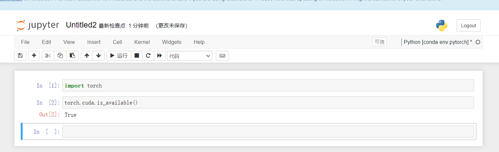

# python 编译器的安装和环境配置

教程中给出的还是经典的pycharm和jupitor的编辑器

## 问题
问题出现在环境配置，需要选择anaconda的环境，首先在setting里找到interpretor,其次要在conda 环境中选择 conda 目录下的scripts目录下的可执行文件conda.exe，然后选择使用已存在环境，然后选择我设置的
环境的名字，比如目前我使用的anaconda环境名字是pytorch

然后使用：
import torch
torch.cuda.is_available()
True
去进行检测是否导入环境成功。

# jupter problem 
安装jpyter时需要执行
conda install nb_conda指令

然而该指令不支持  python11版本
尝试直接install jupyter，可以执行成功，并且运行后也是正常的，但是查询到可以使用conda install -c conda-forge nb_conda可以帮助安装nb——conda包

然而运行时也出现了问题

(pytorch) C:\Users\21293>conda install -c conda conda-forge nb_conda
Collecting package metadata (current_repodata.json): done
Solving environment: unsuccessful initial attempt using frozen solve. Retrying with flexible solve.
Collecting package metadata (repodata.json): done
Solving environment: unsuccessful initial attempt using frozen solve. Retrying with flexible solve.

PackagesNotFoundError: The following packages are not available from current channels:

  - conda-forge

Current channels:

  - https://conda.anaconda.org/conda/win-64
  - https://conda.anaconda.org/conda/noarch
  - https://repo.anaconda.com/pkgs/main/win-64
  - https://repo.anaconda.com/pkgs/main/noarch
  - https://repo.anaconda.com/pkgs/r/win-64
  - https://repo.anaconda.com/pkgs/r/noarch
  - https://repo.anaconda.com/pkgs/msys2/win-64
  - https://repo.anaconda.com/pkgs/msys2/noarch

To search for alternate channels that may provide the conda package you're
looking for, navigate to

    https://anaconda.org

and use the search bar at the top of the page.

通过查询chat后给出的解决方案是

conda config --add channels conda-forge
conda install -c conda-forge nb_conda

然而直接在pytorch环境下使用这两串指令也会出现问题

# 最终的解决方法

## conda deactivate 返回base环境 

## conda config --add channels conda-forge

## Activate your pytorch environment:  conda activate pytorch

## Finally, attempt to install nb_conda from the conda-forge channel: conda install -c conda-forge nb_conda

最终解决问题

